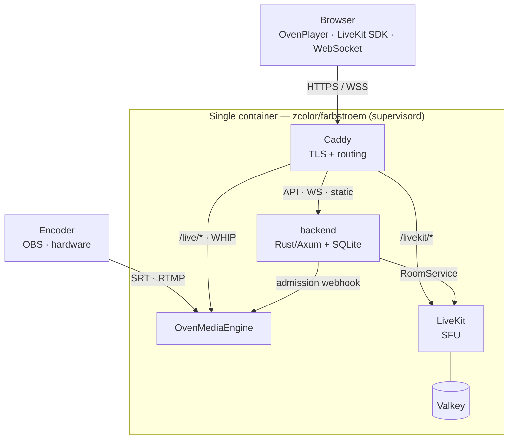

# Farbstroem

Private low-latency streaming platform for color-grading review sessions. Combines an [OvenMediaEngine](https://github.com/AirenSoft/OvenMediaEngine) broadcast pipeline with a [LiveKit](https://github.com/livekit/livekit) SFU for participant voice/video, plus chat, shared pointer, and session file sharing.

## Architecture



The whole stack ships as **one image** (`zcolor/farbstroem`); the five processes run under `supervisord` and reach each other over `localhost`. Caddy owns the single TLS origin and routes by path.

| Process | Source | Purpose |
|---|---|---|
| Caddy | `caddy:2` binary | TLS + routing (`/live/*` → OME, `/livekit/*` → LiveKit, everything else → backend) |
| OvenMediaEngine | `airensoft/ovenmediaengine` base image | Broadcast ingest (SRT/RTMP/WHIP) + viewer delivery (WebRTC/LLHLS) |
| backend | built from source (`backend/`), runs as `app` | Rust/Axum API, WebSocket hub, SQLite, static file serving |
| LiveKit | `livekit/livekit-server` binary | SFU for participant conference |
| Valkey | built from source, runs as `valkey` | Required by LiveKit (Valkey is the BSD-3 fork of Redis 7.2) |

The image is self-contained: the [Dockerfile](Dockerfile) compiles the Rust backend and the TypeScript frontend internally, so deploy hosts need neither the source nor a build toolchain.

## Tech stack

| Layer | Choice |
|---|---|
| Broadcast engine | OvenMediaEngine (SRT / RTMP / WHIP in, WebRTC / LLHLS out, H.265 passthrough) |
| Conference SFU | LiveKit |
| Backend | Rust + [Axum](https://github.com/tokio-rs/axum) 0.8, Tokio |
| Database | SQLite (WAL) via `rusqlite` + `r2d2` pool |
| Frontend | TypeScript ES modules compiled with `tsc` (no bundler, no runtime npm deps) — admin SPA, viewer page, landing page. CDN-loaded OvenPlayer + HLS.js + LiveKit JS SDK |
| Reverse proxy | Caddy 2 (container) |

## Features

- Room management with expiry, passwords, waiting rooms
- Presenter vs viewer roles (presenter role only grantable by admin)
- Per-room viewer delivery mode (WebRTC or LLHLS)
- LiveKit-backed voice/video conference, screen sharing, watch-only mode
- Presenter moderation: kick + server-side mute
- Text chat (persisted per session), file sharing, shared pointer overlay
- Custom branding (logo + background) per deployment
- Keyboard shortcuts for the viewer toolbar (see below)


## Keyboard shortcuts

Single-key shortcuts on the viewer page (`/watch/{slug}`). Ignored while typing
in a text field; modifier combos (Ctrl/Cmd/Alt) are left to the browser. The key
is also shown in each button's hover tooltip.

| Key | Action |
|---|---|
| `Q` | Toggle camera |
| `W` | Toggle microphone |
| `E` | Toggle pointer *(focus view only)* |
| `F` | Enter/exit fullscreen |
| `M` | Mute/unmute the stream |
| `X` | Toggle focus view |
| `C` | Toggle chat panel |
| `V` | Toggle call strip *(focus view only)* |

## Ingest protocols

| Protocol | Port | Notes |
|---|---|---|
| SRT | `9999/udp` | Primary — H.265 passthrough. OBS URL: `srt://<host>:9999?streamid=default/live/<STREAM_KEY>` |
| RTMP | `1935/tcp` | Universal encoder support. URL: `rtmp://<host>:1935/live`, stream name = stream key |
| WHIP | via Caddy `/live/*` | OBS 30+, browser-based encoders |

### Native SRT playback (Farbplay room link)

The native HDR SRT viewer [Farbplay] connects from a room link instead of a raw SRT URL, and
mirrors the browser viewer's lifecycle (waiting room + kick). The flow:

1. **Join** — `POST /api/public/rooms/<slug>/join {name}` → `{participant_id, token, admitted, …}`
   (creates a `participants` row; password, if any, is checked here).
2. **Wait** — if not yet admitted, open the admission SSE
   `GET /api/public/rooms/<slug>/waiting/events/<pid>?token=` and show a waiting screen until the
   `admitted` event.
3. **Play** — `GET https://<host>/api/watch/<slug>?participantId=<pid>&token=<token>` returns the
   SRT target plus a short-lived, HMAC-signed `streamid`:

```jsonc
{
  "srt": { "host": "stream.example.com", "port": 9998,
           "streamid": "default/live/<key>?policy=<b64url>&signature=<b64url-hmac>",
           "latency": 500 },
  "ttlSeconds": 30,
  "title": "Project X"
}
```

OME's `<SignedPolicy>` (in `ome/origin_conf/Server.xml`, scoped to the SRT publisher) validates
the signature + `url_expire` on connect, so each token expires ~30 s after minting; the app
re-fetches on every (re)connect. The signing key is `OME_SIGNED_POLICY_SECRET` (shared between the
backend and OME).

The `/api/watch` endpoint is **admission-gated**: the streamid is minted only for an admitted,
non-kicked participant. Missing `participantId`/`token` or a kicked/not-yet-admitted participant →
**403**; unknown/expired/ended room, wrong token/slug, or a room with no stream key → **404**.
Kick and room-end ride the existing SSE (`kicked` / `room_ended`) for an instant self-disconnect;
the gated GET (403/404) + 30 s TTL is the reconnect backstop, so a kicked viewer cannot reconnect.

> **Security note:** SignedPolicy here provides *expiry / replay-limiting*, not secrecy. The OME
> stream name is the ingest stream key (`OutputStreamName=${OriginStreamName}`), so the key appears
> in the `streamid` in plaintext — and is already handed to web viewers on join. Treat the room
> link as a capability and keep slugs unguessable.

## Local development

**Just run it locally** — `deploy.sh` accepts `localhost`, so the one-command path
works for dev too. It generates `.env` with all required secrets, builds/pulls the
image, and starts the stack on `localhost` (Caddy serves it over its internal
self-signed cert — the browser warns once):

```bash
sudo ./deploy.sh localhost
```

This uses the frontend baked into the image — fine for just running the app. For
**active frontend development** (live `tsc` rebuilds without a Docker rebuild), use
the dev overlay instead. Generate `.env` once, then run `make dev` plus the watcher
in a side terminal:

```bash
./deploy.sh --init-env localhost            # write .env with all secrets, start nothing
# (or fill .env by hand — the backend refuses empty/short secrets)

make dev                                     # build frontend + start the container on localhost
cd frontend && npm install && npm run watch  # rebuilds www/dist/ on every .ts save
```

`make dev` selects `docker-compose.dev.yml` (`-f docker-compose.yml -f docker-compose.dev.yml
up -d --build`), which builds the image from source and bind-mounts `./www`, so a browser
refresh picks up `tsc` rebuilds — no Docker rebuild for frontend changes. Because the bind
mount shadows the image's baked `www/dist/`, `make dev` first runs `npm ci && npm run build`
(the `frontend-build` target) so the dist exists on the host — otherwise `/admin` would serve
a blank page. The watcher above then keeps it fresh. The dev overlay is **not** auto-merged,
so a plain `docker compose up -d` is always the deploy path (pulls the published image;
`www/dist/` is baked in, so production hosts need no Node).

## Production deployment

One command on a **fresh VPS where only Farbstroem runs**:

```bash
sudo ./deploy.sh stream.yourdomain.com
```

That's it. The script installs missing prerequisites (Docker + Compose, openssl), generates `.env` with all secrets, opens the firewall, pulls the published single-container image, brings it up, and prints the admin password once. The frontend is baked into the image, so no Node/build toolchain is needed on the host. The containerized Caddy provisions Let's Encrypt and serves `stream.yourdomain.com` — app, `/live/*` (OME), and LiveKit (proxied same-origin at `/livekit/*`) — no host web server to configure.

**Before running:**
- Point DNS at the VPS for `stream.yourdomain.com` (needed for Let's Encrypt).
- Run as root / with `sudo` (installs packages, opens the firewall).
- Prereq auto-install is apt-based; on other distros install Docker + openssl first.

**Re-running is safe** — an existing `.env` is reused and secrets are not rotated, so a redeploy keeps sessions alive. Flags:

| Flag | Effect |
|---|---|
| `--update` | Pull the newest image and recreate (secrets untouched — live sessions survive). Roll back by pinning `FARBSTROEM_TAG=sha-<short>` (or `vX.Y.Z`) in `.env` first, then `--update`. |
| `--behind-proxy HOST` | Deploy behind an external TLS proxy: the container serves plain HTTP on `127.0.0.1:8880`, presets `SITE_ADDRESS=:80` / `PUBLIC_HOST=HOST` / `WEB_BIND=127.0.0.1`, and skips the firewall + 80/443 free-port check. |
| `--init-env [HOST]` | Generate/refresh `.env` and exit without starting anything (openssl-only; no Docker needed). |
| `--regenerate` | Rewrite `.env` from scratch (rotates secrets) |
| `--yes` | Skip confirmation prompts (unattended) |

The script waits for the container's healthcheck before reporting success, and on a clean box stops early if something already holds 80/443 (use `--behind-proxy` to deploy behind an existing front proxy instead).

**Even simpler — zero-checkout bootstrap.** Both the repo and the `zcolor/farbstroem` image are public, so a fresh host needs no git clone:

```bash
curl -fsSL https://raw.githubusercontent.com/farbhaus/Farbstrom/main/install.sh | bash -s -- stream.yourdomain.com
```

`install.sh` fetches just `docker-compose.yml`, `.env.example`, and `deploy.sh` into `/opt/farbstroem` and hands off to `deploy.sh`; everything after `--` is forwarded (e.g. `--behind-proxy …`).

### Quick local smoke test

```bash
sudo ./deploy.sh localhost
```

Brings the container up on the local machine for an end-to-end check of the script itself. On linux/amd64 the published image is pulled (instant); on ARM hosts (e.g. Apple Silicon Macs) the script builds it from source first. Caddy serves the site over its internal self-signed cert, so the browser will warn once. Use `localhost` — bare IPs (e.g. `127.0.0.1`) are rejected: Let's Encrypt won't issue for them and an IP has no domain for the WebAuthn relying-party ID.

### Manual / advanced configuration

Skip `deploy.sh` and configure `.env` by hand (`cp .env.example .env`). Required secrets, all enforced at startup (backend panics with a clear `FATAL:` otherwise):

| Var | Min | Generate |
|---|---|---|
| `JWT_SECRET`, `OME_WEBHOOK_SECRET`, `OME_API_TOKEN`, `LIVEKIT_API_SECRET` | 32 chars | `openssl rand -hex 32` |
| `ADMIN_PASSWORD` | 12 chars | (bcrypt-hashed once at startup) |
| `LIVEKIT_API_KEY` | — | any identifier (the LiveKit JWT `iss`) |
| `PUBLIC_ORIGIN` | — | exact browser origin, e.g. `https://stream.yourdomain.com` (WebAuthn RP — no path) |

The containerized Caddy ([caddy/Caddyfile](caddy/Caddyfile)) owns **all** routing — app, `/live/*` → OME, and LiveKit (proxied same-origin at `/livekit/*`). For a standalone host where Caddy gets its own Let's Encrypt certs, you only set **one** value:

```bash
SITE_ADDRESS=stream.yourdomain.com
```

`entrypoint.sh` derives the browser-facing URLs from it at startup
(`PUBLIC_ORIGIN=https://stream.yourdomain.com`,
`LIVEKIT_URL=wss://stream.yourdomain.com/livekit`), so they always match the
Caddy-served origin — no need to keep three values in sync.

To run behind an existing reverse proxy (e.g. a host Caddy that already terminates TLS), terminate TLS at your proxy and forward `stream.yourdomain.com` to the stack's HTTP port, with these `.env` values:

```bash
SITE_ADDRESS=:80                        # container Caddy serves plain HTTP, no in-container TLS
PUBLIC_HOST=stream.yourdomain.com       # browser-facing host (SITE_ADDRESS isn't one now) → PUBLIC_ORIGIN/LIVEKIT_URL
HTTP_PORT=8880                          # avoid colliding with the front's :80/:443
HTTPS_PORT=8444
WEB_BIND=127.0.0.1                      # bind the web ports to loopback — Docker bypasses ufw, so without this
                                        # the plain-HTTP port is reachable from the internet, bypassing your TLS
```

`PUBLIC_HOST` is required here: with `SITE_ADDRESS=:80` the container has no usable hostname, so the backend can't derive a valid `PUBLIC_ORIGIN` and panics without it. Then `docker compose -f docker-compose.yml up -d` and point your proxy at `127.0.0.1:8880`.

Firewall ports (the script opens these via ufw/firewalld when active): tcp `80 443 1935 3478 7881`, udp `443 9999 9998 10000-10009 50000-50100`. The 50000-50100/udp LiveKit range is deliberately narrow — wider ranges create thousands of iptables rules and make `docker compose up/down` take minutes.

## Repository layout

```
.
├── Dockerfile                  Single-container image: builds backend + frontend, assembles all 5 services
├── entrypoint.sh               Runtime: derive URLs from SITE_ADDRESS, chown /data, gen livekit.yaml, exec supervisord
├── supervisord.conf            Process supervision (users, start order, secret scoping)
├── backend/                    Rust/Axum backend
├── frontend/                   TypeScript sources (`tsc` only, no bundler) for admin/viewer/landing SPAs
├── caddy/Caddyfile             Caddy config (SITE_ADDRESS envar-driven), baked into the image
├── ome/                        OvenMediaEngine config (Server.xml)
├── www/                        Static HTML/CSS + compiled JS (dist/, built into the image)
├── docker-compose.yml          Base (deploy: pulls zcolor/farbstroem) — plain `docker compose up -d`
├── docker-compose.dev.yml      Opt-in dev overlay (build from source + ./www mount) — `make dev`
├── Makefile                    Thin wrappers: make deploy / dev / update / logs / status / down
├── deploy.sh                   Production deploy: standalone, --behind-proxy, --update, --init-env
├── install.sh                  Zero-checkout bootstrap (curl … | bash -s -- domain)
├── .env.example                Required env vars, documented inline
└── docs/                       Architecture notes, security model, design system
```

## Tests

```bash
cd backend && cargo test
```

Integration tests live in `backend/tests/` and use [`axum-test`](https://crates.io/crates/axum-test).

## License

Farbstroem is licensed under the **GNU Affero General Public License v3.0**
(AGPL-3.0) — see [LICENSE](LICENSE). In short: you are free to use, study,
modify, and self-host it, but if you run a modified version as a network
service you must make your modified source available to its users.

Contributions are accepted under the same license via the Developer Certificate
of Origin — see [CONTRIBUTING.md](CONTRIBUTING.md). Attribution notices for
bundled dependencies are collected in
[THIRD_PARTY_NOTICES.md](THIRD_PARTY_NOTICES.md).

## Acknowledgements

Farbstroem is built on the work of these open-source projects:

- [OvenMediaEngine](https://github.com/AirenSoft/OvenMediaEngine) — broadcast ingest/delivery engine (AGPL-3.0)
- [OvenPlayer](https://github.com/AirenSoft/OvenPlayer) — LLHLS/WebRTC player (MIT)
- [LiveKit](https://github.com/livekit/livekit) — WebRTC SFU for participant conference (Apache-2.0)
- [Caddy](https://github.com/caddyserver/caddy) — TLS termination and routing (Apache-2.0)
- [Axum](https://github.com/tokio-rs/axum) and the broader Rust/Tokio ecosystem (MIT)
- [hls.js](https://github.com/video-dev/hls.js) — HLS playback fallback (Apache-2.0)

…and the many crates enumerated in [THIRD_PARTY_NOTICES.md](THIRD_PARTY_NOTICES.md).
