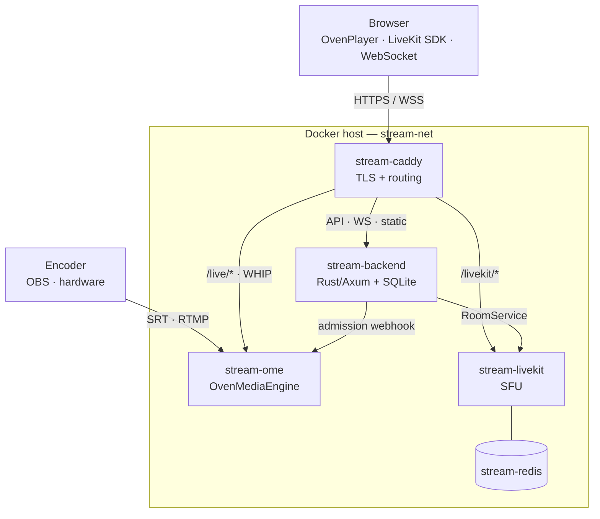

# Farbstroem

Private low-latency streaming platform for color-grading review sessions. Combines an [OvenMediaEngine](https://github.com/AirenSoft/OvenMediaEngine) broadcast pipeline with a [LiveKit](https://github.com/livekit/livekit) SFU for participant voice/video, plus chat, shared pointer, and session file sharing.

## Architecture



All services run on a single Docker bridge network (`stream-net`) and reference each other by container name.

| Container | Image | Purpose |
|---|---|---|
| `stream-caddy` | `caddy:2-alpine` | TLS + routing (`/live/*` → OME, everything else → backend) |
| `stream-ome` | `airensoft/ovenmediaengine:latest` | Broadcast ingest (SRT/RTMP/WHIP) + viewer delivery (WebRTC/LLHLS) |
| `stream-backend` | built from `backend/Dockerfile` | Rust/Axum API, WebSocket hub, SQLite, static file serving |
| `stream-livekit` | `livekit/livekit-server:latest` | SFU for participant conference |
| `stream-redis` | `redis:7-alpine` | Required by LiveKit |

## Tech stack

| Layer | Choice |
|---|---|
| Broadcast engine | OvenMediaEngine (SRT / RTMP / WHIP in, WebRTC / LLHLS out, H.265 passthrough) |
| Conference SFU | LiveKit |
| Backend | Rust + [Axum](https://github.com/tokio-rs/axum) 0.8, Tokio |
| Database | SQLite (WAL) via `rusqlite` + `r2d2` pool |
| Frontend | TypeScript ES modules compiled with `tsc` (no bundler, no runtime npm deps) — admin SPA, viewer page, landing page. CDN-loaded OvenPlayer + HLS.js + LiveKit JS SDK |
| Reverse proxy | Caddy 2 (container) |

## Features

- Room management with expiry, passwords, waiting rooms
- Presenter vs viewer roles (presenter role only grantable by admin — see [security notes](docs/Streaming.md#security-architecture))
- Per-room viewer delivery mode (WebRTC or LLHLS)
- LiveKit-backed voice/video conference, screen sharing, watch-only mode
- Presenter moderation: kick + server-side mute
- Text chat (persisted per session), file sharing, shared pointer overlay
- Custom branding (logo + background) per deployment

## Ingest protocols

| Protocol | Port | Notes |
|---|---|---|
| SRT | `9999/udp` | Primary — H.265 passthrough. OBS URL: `srt://<host>:9999?streamid=default/live/<STREAM_KEY>` |
| RTMP | `1935/tcp` | Universal encoder support. URL: `rtmp://<host>:1935/live`, stream name = stream key |
| WHIP | via Caddy `/live/*` | OBS 30+, browser-based encoders |

## Local development

No deploy script for dev. Fill the secrets (the backend refuses empty/short ones — the
rest of the `.env.example` defaults are already correct for localhost), then run the
stack plus the frontend watcher in a side terminal:

```bash
cp .env.example .env
for k in JWT_SECRET OME_WEBHOOK_SECRET OME_API_TOKEN LIVEKIT_API_SECRET; do
  sed -i "s|^$k=.*|$k=$(openssl rand -hex 32)|" .env
done
sed -i "s|^ADMIN_PASSWORD=.*|ADMIN_PASSWORD=devpassword123|" .env   # ≥12 chars

docker compose up -d --build                 # full stack on localhost
cd frontend && npm install && npm run watch  # rebuilds www/dist/ on every .ts save
```

The backend bind-mounts `./www`, so a browser refresh picks up `tsc` rebuilds — no Docker
rebuild for frontend changes. (Production hosts run `npm ci && npm run build` once so
`www/dist/` exists; `deploy.sh` does this for you.)

Backend dev loop (`cargo check`, `watchexec`, `cargo test`) and required tools: see
[docs/Development.md](docs/Development.md).

## Production deployment

One command on a **fresh VPS where only Farbstroem runs**:

```bash
sudo ./deploy.sh stream.yourdomain.com
```

That's it. The script installs missing prerequisites (Docker + Compose, Node, openssl), generates `.env` with all secrets, opens the firewall, builds the frontend, pulls the published backend image, brings the stack up, and prints the admin password once. The containerized Caddy provisions Let's Encrypt and serves `stream.yourdomain.com` — app, `/live/*` (OME), and LiveKit (proxied same-origin at `/livekit/*`) — no host web server to configure.

**Before running:**
- Point DNS at the VPS for `stream.yourdomain.com` (needed for Let's Encrypt).
- Run as root / with `sudo` (installs packages, opens the firewall).
- Prereq auto-install is apt-based; on other distros install Docker/Node/openssl first.

**Re-running is safe** — an existing `.env` is reused and secrets are not rotated, so a redeploy keeps sessions alive. Flags:

| Flag | Effect |
|---|---|
| `--regenerate` | Rewrite `.env` from scratch (rotates secrets) |
| `--yes` | Skip confirmation prompts (unattended) |

The script targets a clean box: if something already holds ports 80/443, it stops and points you at manual configuration (below) rather than failing cryptically.

### Manual / advanced configuration

Skip `deploy.sh` and configure `.env` by hand (`cp .env.example .env`). Required secrets, all enforced at startup (backend panics with a clear `FATAL:` otherwise):

| Var | Min | Generate |
|---|---|---|
| `JWT_SECRET`, `OME_WEBHOOK_SECRET`, `OME_API_TOKEN`, `LIVEKIT_API_SECRET` | 32 chars | `openssl rand -hex 32` |
| `ADMIN_PASSWORD` | 12 chars | (bcrypt-hashed once at startup) |
| `LIVEKIT_API_KEY` | — | any identifier (the LiveKit JWT `iss`) |
| `PUBLIC_ORIGIN` | — | exact browser origin, e.g. `https://stream.yourdomain.com` (WebAuthn RP — no path) |

The containerized Caddy ([caddy/Caddyfile](caddy/Caddyfile)) owns **all** routing — app, `/live/*` → OME, and LiveKit (proxied same-origin at `/livekit/*`). For a standalone host where Caddy gets its own Let's Encrypt certs, set:

```bash
SITE_ADDRESS=stream.yourdomain.com
LIVEKIT_URL=wss://stream.yourdomain.com/livekit
PUBLIC_ORIGIN=https://stream.yourdomain.com
```

To run behind an existing reverse proxy, set `SITE_ADDRESS=:80` plus `HTTP_PORT`/`HTTPS_PORT` overrides so the published ports don't collide with the front, terminate TLS at your proxy, and forward `stream.yourdomain.com` to the stack's HTTP port. Then `docker compose -f docker-compose.yml up -d`.

Firewall ports (the script opens these via ufw/firewalld when active): tcp `80 443 1935 3478 7881`, udp `443 9999 9998 10000-10009 50000-50100`. The 50000-50100/udp LiveKit range is deliberately narrow — wider ranges create thousands of iptables rules and make `docker compose up/down` take minutes.

## Repository layout

```
.
├── backend/            Rust/Axum backend — see docs/Development.md
├── frontend/           TypeScript sources (`tsc` only, no bundler) for admin/viewer/landing SPAs
├── caddy/Caddyfile     Container Caddy config (SITE_ADDRESS envar-driven)
├── livekit/            LiveKit server config
├── ome/                OvenMediaEngine config
├── www/                Static HTML/CSS + compiled JS (dist/) served by the backend
├── docker-compose.yml
├── .env.example        Required env vars, documented inline
└── docs/               Architecture notes, security model, design system
```

## Tests

```bash
cd backend && cargo test
```

Integration tests live in `backend/tests/` and use [`axum-test`](https://crates.io/crates/axum-test). See [docs/Development.md](docs/Development.md#tests) for single-file runs and common patterns.

## License

Farbstroem is licensed under the **GNU Affero General Public License v3.0**
(AGPL-3.0) — see [LICENSE](LICENSE). In short: you are free to use, study,
modify, and self-host it, but if you run a modified version as a network
service you must make your modified source available to its users.

Contributions are accepted under the same license via the Developer Certificate
of Origin — see [CONTRIBUTING.md](docs/CONTRIBUTING.md). Attribution notices for
bundled dependencies are collected in
[THIRD_PARTY_NOTICES.md](THIRD_PARTY_NOTICES.md).

## Acknowledgements

Farbstroem is built on the work of these open-source projects:

- [OvenMediaEngine](https://github.com/AirenSoft/OvenMediaEngine) — broadcast ingest/delivery engine (AGPL-3.0)
- [OvenPlayer](https://github.com/AirenSoft/OvenPlayer) — LLHLS/WebRTC player (MIT)
- [LiveKit](https://github.com/livekit/livekit) — WebRTC SFU for participant conference (Apache-2.0)
- [Caddy](https://github.com/caddyserver/caddy) — TLS termination and routing (Apache-2.0)
- [Axum](https://github.com/tokio-rs/axum) and the broader Rust/Tokio ecosystem (MIT)
- [hls.js](https://github.com/video-dev/hls.js) — HLS playback fallback (Apache-2.0)

…and the many crates enumerated in [THIRD_PARTY_NOTICES.md](THIRD_PARTY_NOTICES.md).
