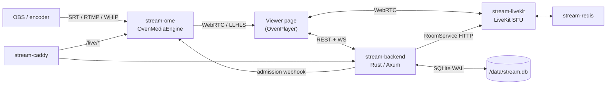

# zStream

Private low-latency streaming platform for color-grading review sessions. Combines an [OvenMediaEngine](https://github.com/AirenSoft/OvenMediaEngine) broadcast pipeline with a [LiveKit](https://github.com/livekit/livekit) SFU for participant voice/video, plus chat, shared pointer, and session file sharing.

## Architecture



All services run on a single Docker bridge network (`stream-net`) and reference each other by container name.

| Container | Image | Purpose |
|---|---|---|
| `stream-caddy` | `caddy:2-alpine` | TLS + routing (`/live/*` → OME, everything else → backend) |
| `stream-ome` | `airensoft/ovenmediaengine:latest` | Broadcast ingest (SRT/RTMP/WHIP) + viewer delivery (WebRTC/LLHLS) |
| `stream-backend` | built from `backend/Dockerfile` | Rust/Axum API, WebSocket hub, SQLite, static file serving |
| `stream-livekit` | `livekit/livekit-server:latest` | SFU for participant conference |
| `stream-redis` | `redis:7-alpine` | Required by LiveKit |

## Tech stack

| Layer | Choice |
|---|---|
| Broadcast engine | OvenMediaEngine (SRT / RTMP / WHIP in, WebRTC / LLHLS out, H.265 passthrough) |
| Conference SFU | LiveKit |
| Backend | Rust + [Axum](https://github.com/tokio-rs/axum) 0.8, Tokio |
| Database | SQLite (WAL) via `rusqlite` + `r2d2` pool |
| Frontend | TypeScript ES modules compiled with `tsc` (no bundler, no runtime npm deps) — admin SPA, viewer page, landing page. CDN-loaded OvenPlayer + HLS.js + LiveKit JS SDK |
| Reverse proxy | Caddy 2 (container) |

## Features

- Room management with expiry, passwords, waiting rooms
- Presenter vs viewer roles (presenter role only grantable by admin — see [security notes](Streaming.md#security-architecture))
- Per-room viewer delivery mode (WebRTC or LLHLS)
- LiveKit-backed voice/video conference, screen sharing, watch-only mode
- Presenter moderation: kick + server-side mute
- Text chat (persisted per session), file sharing, shared pointer overlay
- Custom branding (logo + background) per deployment

## Ingest protocols

| Protocol | Port | Notes |
|---|---|---|
| SRT | `9999/udp` | Primary — H.265 passthrough. OBS URL: `srt://<host>:9999?streamid=default/live/<STREAM_KEY>` |
| RTMP | `1935/tcp` | Universal encoder support. URL: `rtmp://<host>:1935/live`, stream name = stream key |
| WHIP | via Caddy `/live/*` | OBS 30+, browser-based encoders |

## Local development

No deploy script for dev. Fill the secrets (the backend refuses empty/short ones — the
rest of the `.env.example` defaults are already correct for localhost), then run the
stack plus the frontend watcher in a side terminal:

```bash
cp .env.example .env
for k in JWT_SECRET OME_WEBHOOK_SECRET OME_API_TOKEN LIVEKIT_API_SECRET; do
  sed -i "s|^$k=.*|$k=$(openssl rand -hex 32)|" .env
done
sed -i "s|^ADMIN_PASSWORD=.*|ADMIN_PASSWORD=devpassword123|" .env   # ≥12 chars

docker compose up -d --build                 # full stack on localhost
cd frontend && npm install && npm run watch  # rebuilds www/dist/ on every .ts save
```

The backend bind-mounts `./www`, so a browser refresh picks up `tsc` rebuilds — no Docker
rebuild for frontend changes. (Production hosts run `npm ci && npm run build` once so
`www/dist/` exists; `deploy.sh` does this for you.)

Backend dev loop (`cargo check`, `watchexec`, `cargo test`) and required tools: see
[backend/DEVELOPMENT.md](backend/DEVELOPMENT.md).

## Production deployment

One command on a **fresh VPS where only zStream runs**:

```bash
sudo ./deploy.sh stream.yourdomain.com
```

That's it. The script installs missing prerequisites (Docker + Compose, Node, openssl), generates `.env` with all secrets, opens the firewall, builds the frontend, brings the stack up, and prints the admin password once. The containerized Caddy provisions Let's Encrypt and serves both `stream.yourdomain.com` (app + `/live/`) and `lk.stream.yourdomain.com` (LiveKit) — no host web server to configure.

**Before running:**
- Point DNS at the VPS for **both** `stream.yourdomain.com` and `lk.stream.yourdomain.com` (needed for Let's Encrypt).
- Run as root / with `sudo` (installs packages, opens the firewall).
- Prereq auto-install is apt-based; on other distros install Docker/Node/openssl first.

**Re-running is safe** — an existing `.env` is reused and secrets are not rotated, so a redeploy keeps sessions alive. Flags:

| Flag | Effect |
|---|---|
| `--regenerate` | Rewrite `.env` from scratch (rotates secrets) |
| `--yes` | Skip confirmation prompts (unattended) |
| `--behind-host-caddy` | *Advanced.* Host Caddy fronts the stack; the script edits `/etc/caddy/Caddyfile` |
| `--reverse-proxy` | *Advanced.* Stack serves HTTP on `:8880`; you point your existing nginx/etc. at it (prints the server blocks; touches nothing) |

The script targets a clean box: if something already holds ports 80/443, it stops and points you at the advanced flags rather than failing cryptically.

### Manual / advanced configuration

Skip `deploy.sh` and configure `.env` by hand (`cp .env.example .env`). Required secrets, all enforced at startup (backend panics with a clear `FATAL:` otherwise):

| Var | Min | Generate |
|---|---|---|
| `JWT_SECRET`, `OME_WEBHOOK_SECRET`, `OME_API_TOKEN`, `LIVEKIT_API_SECRET` | 32 chars | `openssl rand -hex 32` |
| `ADMIN_PASSWORD` | 12 chars | (bcrypt-hashed once at startup) |
| `LIVEKIT_API_KEY` | — | any identifier (the LiveKit JWT `iss`) |
| `PUBLIC_ORIGIN` | — | exact browser origin, e.g. `https://stream.yourdomain.com` (WebAuthn RP — no path) |

The containerized Caddy ([caddy/Caddyfile](caddy/Caddyfile)) owns **all** routing (app, `/live/*` → OME, LiveKit). The mode only changes *who terminates TLS* — set these in `.env` (this is exactly what the corresponding `deploy.sh` flag writes):

```bash
# Standalone (default) — container gets its own Let's Encrypt certs
SITE_ADDRESS=stream.yourdomain.com
LK_SITE_ADDRESS=lk.stream.yourdomain.com
LIVEKIT_URL=wss://lk.stream.yourdomain.com

# Behind a host Caddy / reverse proxy — stack serves plain HTTP on :8880,
# the front terminates TLS for both names and forwards them to :8880
SITE_ADDRESS=:80
HTTP_PORT=8880
HTTPS_PORT=8444
LK_SITE_ADDRESS=http://lk.stream.yourdomain.com
LIVEKIT_URL=wss://lk.stream.yourdomain.com
```

For a host Caddy, add the blocks from [caddyfile.example](caddyfile.example) (both hostnames → `localhost:8880`) and `systemctl reload caddy`. Then `docker compose up -d`.

Firewall ports (the script opens these via ufw/firewalld when active): tcp `80 443 1935 3478 7881`, udp `443 9999 9998 10000-10009 50000-50100`. The 50000-50100/udp LiveKit range is deliberately narrow — wider ranges create thousands of iptables rules and make `docker compose up/down` take minutes.

## Repository layout

```
.
├── backend/            Rust/Axum backend — see backend/DEVELOPMENT.md
├── frontend/           TypeScript sources (`tsc` only, no bundler) for admin/viewer/landing SPAs
├── caddy/Caddyfile     Container Caddy config (SITE_ADDRESS envar-driven)
├── livekit/            LiveKit server config
├── ome/                OvenMediaEngine config
├── www/                Static HTML/CSS + compiled JS (dist/) served by the backend
├── docker-compose.yml
├── .env.example        Required env vars, documented inline
└── Streaming.md        Project memory — architecture details, pitfalls, security notes
```

## Tests

```bash
cd backend && cargo test
```

Integration tests live in `backend/tests/` and use [`axum-test`](https://crates.io/crates/axum-test). See [backend/DEVELOPMENT.md](backend/DEVELOPMENT.md#tests) for single-file runs and common patterns.
