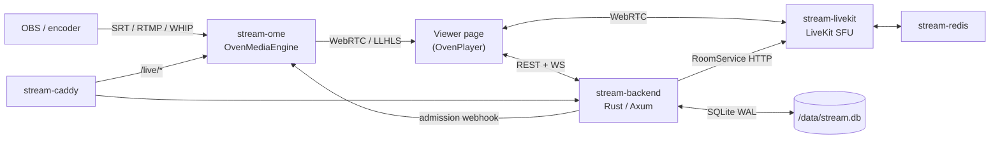

# zStream

Private low-latency streaming platform for color-grading review sessions. Combines an [OvenMediaEngine](https://github.com/AirenSoft/OvenMediaEngine) broadcast pipeline with a [LiveKit](https://github.com/livekit/livekit) SFU for participant voice/video, plus chat, shared pointer, and session file sharing.

## Architecture



All services run on a single Docker bridge network (`stream-net`) and reference each other by container name.

| Container | Image | Purpose |
|---|---|---|
| `stream-caddy` | `caddy:2-alpine` | TLS + routing (`/live/*` → OME, everything else → backend) |
| `stream-ome` | `airensoft/ovenmediaengine:latest` | Broadcast ingest (SRT/RTMP/WHIP) + viewer delivery (WebRTC/LLHLS) |
| `stream-backend` | built from `backend/Dockerfile` | Rust/Axum API, WebSocket hub, SQLite, static file serving |
| `stream-livekit` | `livekit/livekit-server:latest` | SFU for participant conference |
| `stream-redis` | `redis:7-alpine` | Required by LiveKit |

## Tech stack

| Layer | Choice |
|---|---|
| Broadcast engine | OvenMediaEngine (SRT / RTMP / WHIP in, WebRTC / LLHLS out, H.265 passthrough) |
| Conference SFU | LiveKit |
| Backend | Rust + [Axum](https://github.com/tokio-rs/axum) 0.8, Tokio |
| Database | SQLite (WAL) via `rusqlite` + `r2d2` pool |
| Frontend | TypeScript ES modules compiled with `tsc` (no bundler, no runtime npm deps) — admin SPA, viewer page, landing page. CDN-loaded OvenPlayer + HLS.js + LiveKit JS SDK |
| Reverse proxy | Caddy 2 (container) |

## Features

- Room management with expiry, passwords, waiting rooms
- Presenter vs viewer roles (presenter role only grantable by admin — see [security notes](Streaming.md#security-architecture))
- Per-room viewer delivery mode (WebRTC or LLHLS)
- LiveKit-backed voice/video conference, screen sharing, watch-only mode
- Presenter moderation: kick + server-side mute
- Text chat (persisted per session), file sharing, shared pointer overlay
- Custom branding (logo + background) per deployment

## Ingest protocols

| Protocol | Port | Notes |
|---|---|---|
| SRT | `9999/udp` | Primary — H.265 passthrough. OBS URL: `srt://<host>:9999?streamid=default/live/<STREAM_KEY>` |
| RTMP | `1935/tcp` | Universal encoder support. URL: `rtmp://<host>:1935/live`, stream name = stream key |
| WHIP | via Caddy `/live/*` | OBS 30+, browser-based encoders |

## Local development

No deploy script needed for dev — copy the env template, fill the four secrets (the
backend refuses to start with empty/short ones), then run the stack and the frontend
watcher:

```bash
cp .env.example .env
for k in JWT_SECRET OME_WEBHOOK_SECRET OME_API_TOKEN LIVEKIT_API_SECRET; do
  sed -i "s|^$k=.*|$k=$(openssl rand -hex 32)|" .env
done
sed -i "s|^ADMIN_PASSWORD=.*|ADMIN_PASSWORD=devpassword123|" .env   # ≥12 chars
docker compose up -d --build      # full stack on localhost
cd frontend && npm run watch      # side terminal — rebuilds www/dist/ on every .ts save
```

The remaining `.env.example` defaults (`localhost`, `devkey`, `ws://localhost:7880`) are
already correct for local dev.

Backend (Rust): see [backend/DEVELOPMENT.md](backend/DEVELOPMENT.md) for the dev loop (`cargo check`, `watchexec`, `cargo test`), required tools (mold/clang on Linux, `watchexec-cli`), and environment variables.

Frontend (TypeScript): `tsc` only — no bundler. After installing once, keep the watcher running in a side terminal:

```bash
cd frontend && npm install        # one-time
npm run watch                     # rebuilds www/dist/ on every .ts save
```

The backend container bind-mounts `./www`, so hard-refreshing the browser picks up the new build immediately — no Docker rebuild needed for frontend changes. Production hosts must run `npm ci && npm run build` before `docker compose up -d` so `www/dist/` exists on disk.

## Production deployment

### Prerequisites

- Docker and Docker Compose v2
- A domain name (if running standalone with TLS) or an external reverse proxy
- Firewall: open the ingest ports plus `50000-50100/udp` and `7881/tcp` for LiveKit media
- UDP 50000-50100 is deliberately narrow — larger ranges create thousands of iptables rules per port and make `docker compose up/down` take minutes

### One-click deploy (recommended)

From a clean checkout to a running TLS deployment in one command:

```bash
./deploy.sh stream.yourdomain.com
```

In one command this generates `.env` (all secrets), builds the frontend, and runs `docker compose up -d --build`. It picks a TLS mode automatically:

- **Standalone (default)** — the containerized Caddy provisions Let's Encrypt for both `stream.yourdomain.com` and `lk.stream.yourdomain.com` itself. Nothing else is needed on a dedicated host.
- **Behind host Caddy** — auto-selected when a populated `/etc/caddy/Caddyfile` is found (the host already serves other domains, e.g. the project VPS). The script installs Caddy if missing and appends pure TLS-front blocks forwarding both hostnames → `:8880` (idempotent; existing blocks backed up and left untouched; see [caddyfile.example](caddyfile.example)).

Force a mode with `--standalone` or `--behind-host-caddy`. The generated admin password is printed once at the end — save it. Re-running is safe: an existing `.env` is reused and secrets are **not** rotated (live sessions survive a redeploy); `--regenerate` starts fresh, `--yes` skips confirmation prompts. Point DNS at the host for both `stream.yourdomain.com` and `lk.stream.yourdomain.com` before running.

> Behind-host-caddy mode edits `/etc/caddy/Caddyfile` and may install Caddy — run with `sudo` (or as root). Auto-install supports apt-based distros; on others install [Caddy](https://caddyserver.com/docs/install) first and the script only edits the config.

### Manual configuration (fallback)

```bash
cp .env.example .env
# Edit .env — all secrets enforced at startup:
#   JWT_SECRET            ≥ 32 chars  (openssl rand -hex 32)
#   OME_WEBHOOK_SECRET    ≥ 32 chars  (openssl rand -hex 32)
#   LIVEKIT_API_SECRET    ≥ 32 chars  (openssl rand -hex 32)
#   LIVEKIT_API_KEY       required    (becomes the iss claim in LiveKit JWTs)
#   ADMIN_PASSWORD        ≥ 12 chars  (bcrypt-hashed once at startup)
```

The backend panics with a clear `FATAL:` message at startup if any of these are missing or too short.

The containerized Caddy ([caddy/Caddyfile](caddy/Caddyfile)) owns **all** zStream routing — the app, `/live/*` → OME, and the LiveKit subdomain. The two models below differ only in *who terminates TLS*.

### Standalone — container TLS (default)

The containerized Caddy provisions Let's Encrypt for both the app and the LiveKit subdomain. Set in `.env`:

```bash
SITE_ADDRESS=stream.yourdomain.com        # app + /live/  (container auto-TLS)
LK_SITE_ADDRESS=lk.stream.yourdomain.com  # LiveKit SFU   (container auto-TLS)
LIVEKIT_URL=wss://lk.stream.yourdomain.com
```

```bash
docker compose up -d
```

Point DNS for both names at the host (ports 80/443 must be reachable for ACME) before starting. This is what `deploy.sh` does by default — no host Caddy involved.

### Behind a host Caddy (shared host, e.g. the project VPS)

When the host already serves other domains, its system Caddy multiplexes 80/443 and forwards both zStream hostnames to the container, which serves plain HTTP and still does all the routing. Set in `.env`:

```bash
SITE_ADDRESS=:80                                 # disables container auto-HTTPS
HTTP_PORT=8880                                   # container HTTP, behind host Caddy
HTTPS_PORT=8444                                  # moved off 443 so it can't collide
LK_SITE_ADDRESS=http://lk.stream.yourdomain.com  # HTTP; host Caddy does TLS
LIVEKIT_URL=wss://lk.stream.yourdomain.com
```

```bash
docker compose up -d
```

Then add the host blocks from [caddyfile.example](caddyfile.example) (both hostnames → `localhost:8880`) to `/etc/caddy/Caddyfile` and `systemctl reload caddy`. `deploy.sh` auto-selects this mode when a populated `/etc/caddy/Caddyfile` is detected and installs/appends for you.

## Repository layout

```
.
├── backend/            Rust/Axum backend — see backend/DEVELOPMENT.md
├── frontend/           TypeScript sources (`tsc` only, no bundler) for admin/viewer/landing SPAs
├── caddy/Caddyfile     Container Caddy config (SITE_ADDRESS envar-driven)
├── livekit/            LiveKit server config
├── ome/                OvenMediaEngine config
├── www/                Static HTML/CSS + compiled JS (dist/) served by the backend
├── docker-compose.yml
├── .env.example        Required env vars, documented inline
└── Streaming.md        Project memory — architecture details, pitfalls, security notes
```

## Tests

```bash
cd backend && cargo test
```

Integration tests live in `backend/tests/` and use [`axum-test`](https://crates.io/crates/axum-test). See [backend/DEVELOPMENT.md](backend/DEVELOPMENT.md#tests) for single-file runs and common patterns.
