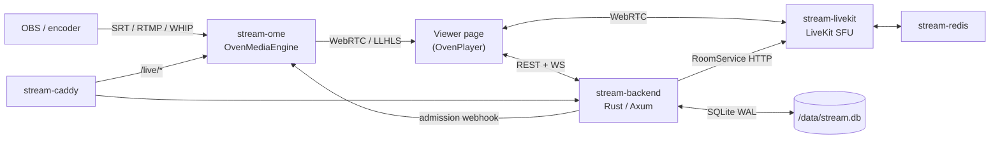

# zStream

Private low-latency streaming platform for color-grading review sessions. Combines an [OvenMediaEngine](https://github.com/AirenSoft/OvenMediaEngine) broadcast pipeline with a [LiveKit](https://github.com/livekit/livekit) SFU for participant voice/video, plus chat, shared pointer, and session file sharing.

## Architecture



All services run on a single Docker bridge network (`stream-net`) and reference each other by container name.

| Container | Image | Purpose |
|---|---|---|
| `stream-caddy` | `caddy:2-alpine` | TLS + routing (`/live/*` → OME, everything else → backend) |
| `stream-ome` | `airensoft/ovenmediaengine:latest` | Broadcast ingest (SRT/RTMP/WHIP) + viewer delivery (WebRTC/LLHLS) |
| `stream-backend` | built from `backend/Dockerfile` | Rust/Axum API, WebSocket hub, SQLite, static file serving |
| `stream-livekit` | `livekit/livekit-server:latest` | SFU for participant conference |
| `stream-redis` | `redis:7-alpine` | Required by LiveKit |

## Tech stack

| Layer | Choice |
|---|---|
| Broadcast engine | OvenMediaEngine (SRT / RTMP / WHIP in, WebRTC / LLHLS out, H.265 passthrough) |
| Conference SFU | LiveKit |
| Backend | Rust + [Axum](https://github.com/tokio-rs/axum) 0.8, Tokio |
| Database | SQLite (WAL) via `rusqlite` + `r2d2` pool |
| Frontend | Vanilla JS — admin SPA (`www/admin/`) + viewer page (`www/viewer/`) with OvenPlayer and the LiveKit JS SDK |
| Reverse proxy | Caddy 2 (container) |

## Features

- Room management with expiry, passwords, waiting rooms
- Presenter vs viewer roles (presenter role only grantable by admin — see [security notes](Streaming.md#security-architecture))
- Per-room viewer delivery mode (WebRTC or LLHLS)
- LiveKit-backed voice/video conference, screen sharing, watch-only mode
- Presenter moderation: kick + server-side mute
- Text chat (persisted per session), file sharing, shared pointer overlay
- Custom branding (logo + background) per deployment

## Ingest protocols

| Protocol | Port | Notes |
|---|---|---|
| SRT | `9999/udp` | Primary — H.265 passthrough. OBS URL: `srt://<host>:9999?streamid=default/live/<STREAM_KEY>` |
| RTMP | `1935/tcp` | Universal encoder support. URL: `rtmp://<host>:1935/live`, stream name = stream key |
| WHIP | via Caddy `/live/*` | OBS 30+, browser-based encoders |

## Local development

See [backend/DEVELOPMENT.md](backend/DEVELOPMENT.md) for the dev loop (`cargo check`, `watchexec`, `cargo test`), required tools (mold/clang on Linux, `watchexec-cli`), and environment variables.

## Production deployment

### Prerequisites

- Docker and Docker Compose v2
- A domain name (if running standalone with TLS) or an external reverse proxy
- Firewall: open the ingest ports plus `50000-50100/udp` and `7881/tcp` for LiveKit media
- UDP 50000-50100 is deliberately narrow — larger ranges create thousands of iptables rules per port and make `docker compose up/down` take minutes

### Configuration

```bash
cp .env.example .env
# Edit .env — all secrets enforced at startup:
#   JWT_SECRET            ≥ 32 chars  (openssl rand -hex 32)
#   OME_WEBHOOK_SECRET    ≥ 32 chars  (openssl rand -hex 32)
#   LIVEKIT_API_SECRET    ≥ 32 chars  (openssl rand -hex 32)
#   LIVEKIT_API_KEY       required    (becomes the iss claim in LiveKit JWTs)
#   ADMIN_PASSWORD        ≥ 12 chars  (bcrypt-hashed once at startup)
```

The backend panics with a clear `FATAL:` message at startup if any of these are missing or too short.

### Standalone (with automatic TLS)

```bash
SITE_ADDRESS=stream.yourdomain.com docker compose up -d
```

Caddy will provision Let's Encrypt certificates automatically on first run. Point DNS at the host before starting.

### Behind an external reverse proxy

```bash
# .env
SITE_ADDRESS=:80
HTTP_PORT=8880
```

```bash
docker compose up -d
```

Then proxy `stream.yourdomain.com → localhost:8880` and `lk.stream.yourdomain.com → localhost:7880` from the host. Auto-HTTPS is disabled by `SITE_ADDRESS=:80`; the outer proxy handles TLS.

### LiveKit subdomain

LiveKit needs its own subdomain (e.g. `lk.stream.yourdomain.com`) proxying to port 7880 because the JS client uses it for WebSocket signaling. When proxying through Caddy, include `header_up Host {upstream_hostport}` on that site block.

## Repository layout

```
.
├── backend/            Rust/Axum backend — see backend/DEVELOPMENT.md
├── caddy/Caddyfile     Container Caddy config (SITE_ADDRESS envar-driven)
├── livekit/            LiveKit server config
├── ome/                OvenMediaEngine config
├── www/                Admin SPA + viewer page (served by the backend)
├── docker-compose.yml
├── .env.example        Required env vars, documented inline
└── Streaming.md        Project memory — architecture details, pitfalls, security notes
```

## Tests

```bash
cd backend && cargo test
```

Integration tests live in `backend/tests/` and use [`axum-test`](https://crates.io/crates/axum-test). See [backend/DEVELOPMENT.md](backend/DEVELOPMENT.md#tests) for single-file runs and common patterns.
